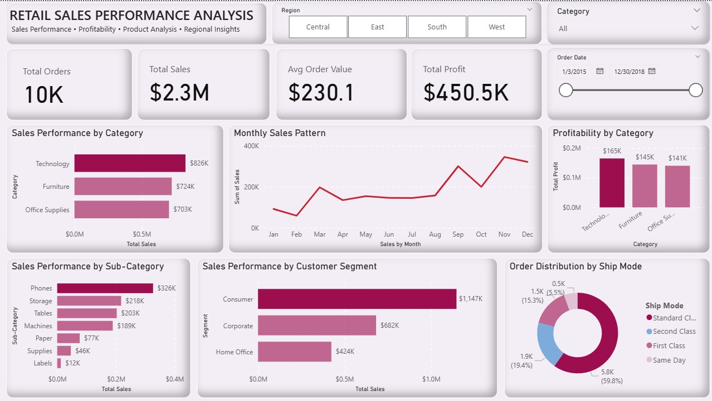

# Retail Sales Performance Analysis

## Project Overview

This project analyzes retail order data to understand sales performance, profitability, customer purchasing patterns, and monthly sales trends.

The dashboard brings key metrics and business views into a single interactive report, making it easier to identify strong-performing categories, customer segments, and regional sales patterns.

## Business Objective

The objective is to answer key business questions such as:

* How much revenue and profit is being generated?
* Which product categories contribute the most to sales?
* Which sub-categories perform best?
* Which customer segments generate the highest sales?
* How do sales change throughout the year?
* How are orders distributed across different shipping modes?
* How does performance vary across regions?

## Tech Stack

* **Power BI** — Dashboard development and interactive visualization
* **Power Query** — Data cleaning and transformation
* **DAX** — Measures, KPIs, and calculated metrics
* **Excel** — Data inspection and preparation

## Dashboard Features

* KPI cards for Total Orders, Total Sales, Average Order Value, and Total Profit
* Regional filtering
* Category filtering
* Order date range filtering
* Sales performance by category
* Monthly sales trend analysis
* Profitability by category
* Sales performance by sub-category
* Sales by customer segment
* Order distribution by shipping mode
* Interactive cross-filtering

## Key Insights

* The dataset contains approximately **10K orders**.
* Total sales are approximately **$2.3M**.
* Average order value is approximately **$230.1**.
* Total profit is approximately **$450.5K**.
* **Technology** generates the highest sales among the major product categories.
* **Phones** are the strongest-performing sub-category by sales.
* The **Consumer** segment contributes the highest sales among customer segments.
* Sales show noticeable variation across months, with stronger performance toward the later part of the year.
* **Standard Class** accounts for the largest share of orders among shipping modes.

## Dashboard Preview

## Project Files

| File                                     | Description             |
| ---------------------------------------- | ----------------------- |
| `Retail_Sales_Performance_Analysis.pbix` | Power BI dashboard file |
| `Retail_Sales_Performance_Analysis.png`  | Dashboard preview       |
| `README.md`                              | Project documentation   |

## Skills Demonstrated

* Data Cleaning & Transformation
* Data Modeling
* DAX Measures
* KPI Development
* Data Visualization
* Interactive Dashboard Design
* Business-Oriented Analysis
* Insight Generation

